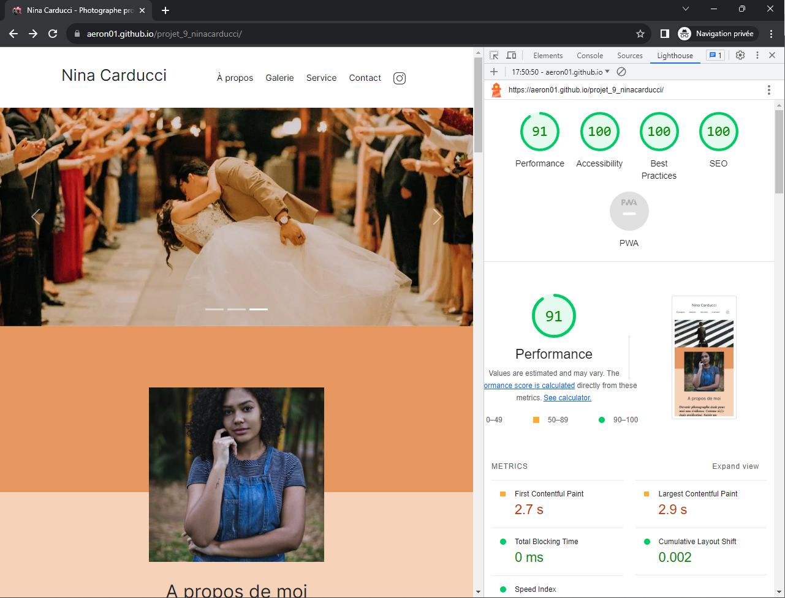

# Optimisez le référencement d'un site de photographe

Neuvième projet du parcours "D'intégrateur web" chez OpenClassroom. L'objectif est d'optimiser la performance du site web de la photographe professionnelle Nina Carducci.

Vous pouvez retrouver le site d'origine [ici](https://ninacarducci.github.io/).

Et de son repo github [la](https://github.com/ninacarducci/ninacarducci.github.io).

_Voici une capture d'écran du résultat de ma réalisation_



## Objectifs

Étant développeur freelance, j'ai démarcher Mme Nina Carducci, pour lui proposé l'optimisation de son site web. Ce dernier est bien codé, mais il pêche sur ses performances et son SEO.
Je propose à ma cliente les prestations suivantes :

1. Optimiser les images du site : des images trop lourdes rendent la page très longue à charger.
2. Optimiser le code et sa structure afin d’améliorer le chargement et l’accessibilité du site.
   Ce qui permettra à la cliente d'avoir un meilleur référencement (SEO) et donc plus de visibilité pour vos potentiels clients.

Afin qu'elle puisse voir les résultats d’optimisation, je lui livrerai le code optimisé, mais aussi un rapport d’optimisation montrant :

- les performances de son site avant/après optimisation (en me basant sur un audit Lighthouse et un audit Wave pour l’accessibilité) ;
- la liste des modifications que j’ai apportées à votre site.

Ma cliente accepte et au final voici ce qui est prévu :

- Faire une optimisation globale du site tant sur les performances que sur le SEO.
- Mettre en place le référencement local en utilisant Schema.org.
- Ajouter les metas pour les réseaux sociaux.
- Faire les modifications liées à l’accessibilité du site.
- Produire un rapport d’optimisation présentant toutes vos actions et leur impact.

D'intégrer les infos suivantes pour son référencement locales :

- Son adresse : 68 avenue Alsace-Lorraine, 33200 Bordeaux.
- Son numéro de téléphone : 05 56 67 78 89.
- Ses horaires du lundi au vendredi de 10 h à 19 h.

## Ma tache

- Faire une optimisation globale du site tant sur les performances que sur le SEO.
- Mettre en place le référencement local en utilisant Schema.org.
- Ajouter les metas pour les réseaux sociaux.
- Faire les modifications liées à l’accessibilité du site.
- Etablirent les audites Lighthouse et wave.
- Etablir le rapport des modifications accomplies.

## Livrables

### Optimisation

**Performance**

- **Dimensionnez correctement les images**
- **Diffusez des images aux formats nouvelle génération**
- **Éliminez les ressources qui bloquent le rendu (bootstrap, google fonts et jquery)**
- **Réduire l'impact du code tiers (google fonts et jquery)**
- **Réduisez le travail du thread principal**

**Accesibilité**

- **Des éléments d'image n'ont pas d'attribut [alt]**
- **Les éléments de formulaire ne sont pas associés à des libellés**
- **Le document ne contient pas d'élément `<title>`**
- **Les liens n'ont pas de nom visible (a.social-link)**
- **Les couleurs d'arrière-plan et de premier plan ne sont pas suffisamment contrastées**
- **L'élément `<html>` n'a pas d'attribut [lang]**
- **Les éléments d'en-tête ne sont pas classés séquentiellement par ordre décroissant**

**SEO**

- **Le document ne contient pas d'attribut "meta description"**
- **Ajout des balises meta Opengrap et twitter**
- **Ajout des balises de référencement local client**
- **La notation sous forme d'icône d'étoiles**
- **Deux collapseurs qui auront pour titres description et équipements**

## Technologies

**Autorisés:** HTML / bootstrap / CSS / sass / Jquery / JS

**Recommandée:** HTML / CSS / minifer / JS / webp

**Interdit:** Rien

## Notes

**Polices :**

- Logo, titres & textes: Inter & Spectral

**Contraintes :**

- Maquette desktop : non
- Maquette Mobile : non
- Validation Lighthouse : Rapport d’audit Lighthouse complet après amélioration du site (mobile & desktop). Les notes doivent être égales ou suppérieures à 90%.
- Validation Wave : capture d’écran de Wave, montrant que le code ne comporte pas d’erreur.
- Validation Rich snippet : capture d'écran de Rich Snippet Google avec les informations du client.
- Validation W3C HTML : pas obligatoire dans ce projet mais à passer de préférence, warning autorisés.
- Validation W3C CSS : pas obligatoire dans ce projet mais à passer de préférence, warning autorisés.
- Compatibilité : Dernières versions de Chrome, Firefox & Safari.
- Général : Le code ne doit pas produire d'erreur ou de warning dans la console.

## Convention nommage commit

Gitmoji https://gitmoji.dev/

## Tester le projet

Pour tester simplement & rapidement, je vous invite a mon résultat [ici](https://aeron01.github.io/projet_9_ninacarducci/), ou à cloner le project.

clonez le projet :

```terminal
git clone https://github.com/Aeron01/projet_9_ninacarducci.git
```
